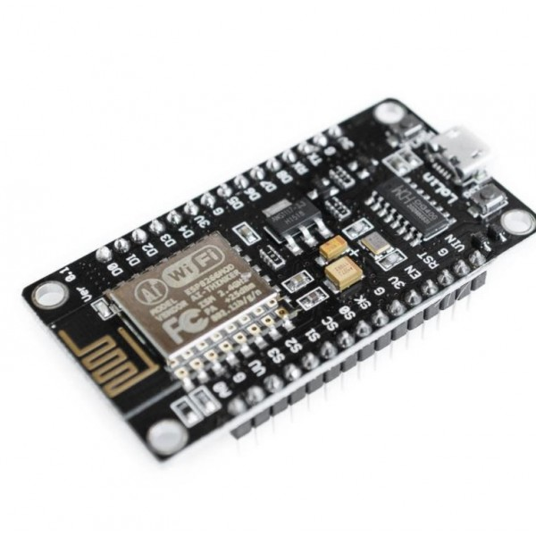
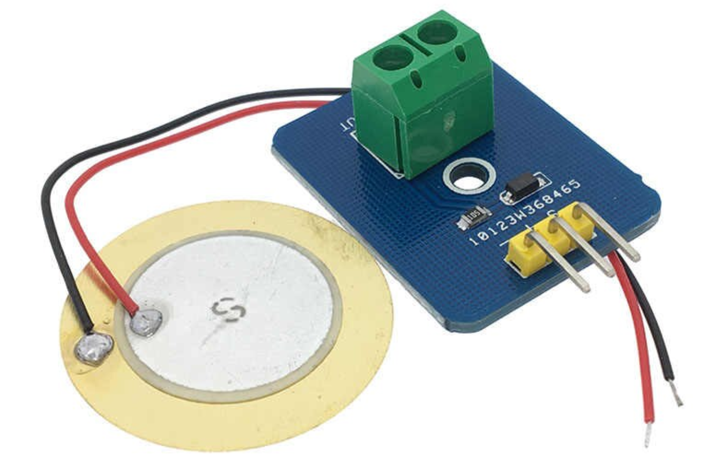
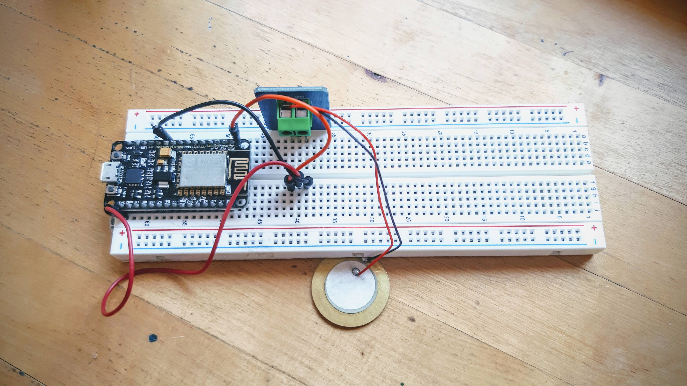
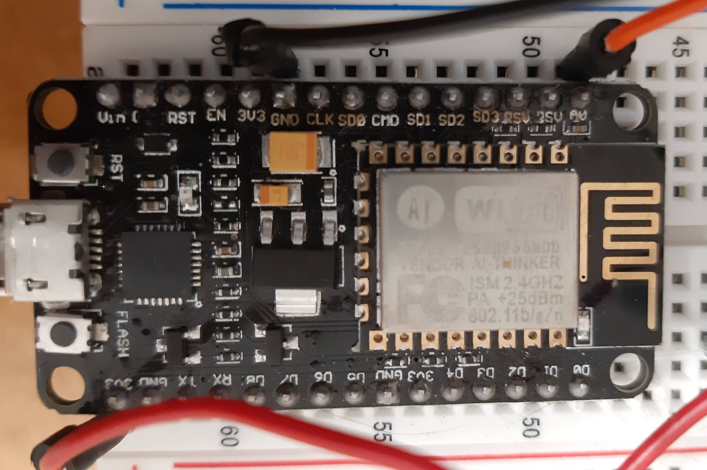

# NodeMCU vibration sensors

## The hardware

### NodeMCU (dev friendly esp8266)

### Pin diagram

### Piezo electric sensor

## The circuit

* Connect NodeMCU `A0` pin to the sensor `S` pin
* Connect any NodeMCU `3v3` pin to the sensor `+` pin
* Connect any NodeMCU `gnd` pin to the sensor `-` pin

## The software

* [Arduino IDE](https://www.arduino.cc/en/main/software)

## IDE configuration

* Launch the Arduino IDE
* Open `File` menu and select `preferences`
* Click on the `Additional Boards Manager URLs` textfield and type this: `http://arduino.esp8266.com/stable/package_esp8266com_index.json`
* Accept preferences changes
* Let the IDE update the libraries
* Open `Tools` menu, select `Boards` and click on `Boards Manager`
* Type  `esp8266` in the search box and select the resulting bundle
* Click on the `install` button to download the latest version
* Once downloaded, select `NodeMCU 1.0 (ESP-12E Module)` as your active board in the `Tools->Board` menu

## Programming 

* Open the [vibrationsensor.ini](vibrationsensor.ino) file and copy the code to the editor 
* Update the [lines 7, 8 and 9](https://github.com/ciberado/iotworkshop-bridge/blob/master/arduino/vibrationsensor.ino#L7) with your own parameters
* Save it (with that same name, `vibrationsensor.ino`)

## Running the program

* Connect your *NodeMCU*
* On *Windows*, you can run the `mode`command to learn which `COM:` port is using your board
* Upload the code by pressing `ctrl`+`u` and selecting the correct `COM:` port
* Now open the `Tools` menu again and select the `Serial Monitor`
* On the lower right part of the monitor, set the connection speed to 115200
* You should see how each time you move the sensor, a new event is sent to your *edge device*

